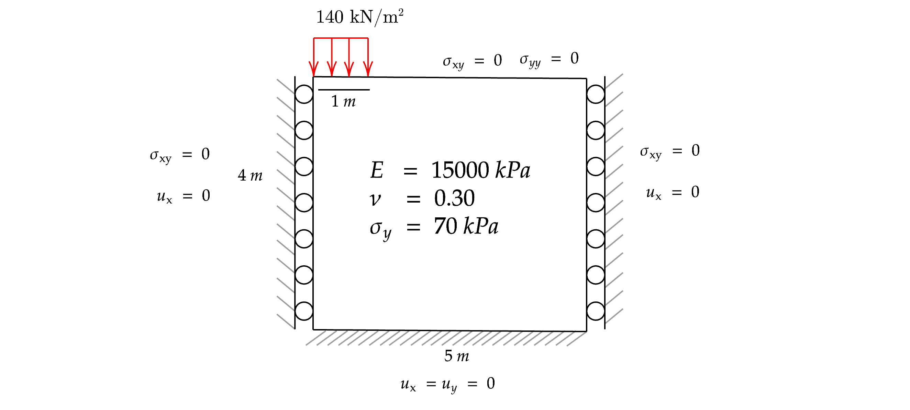
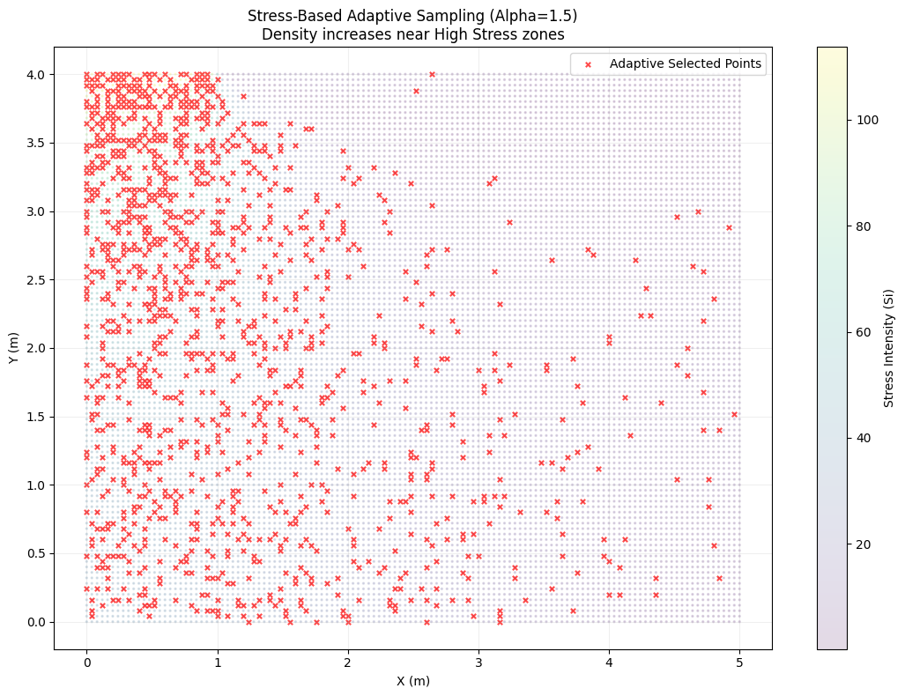
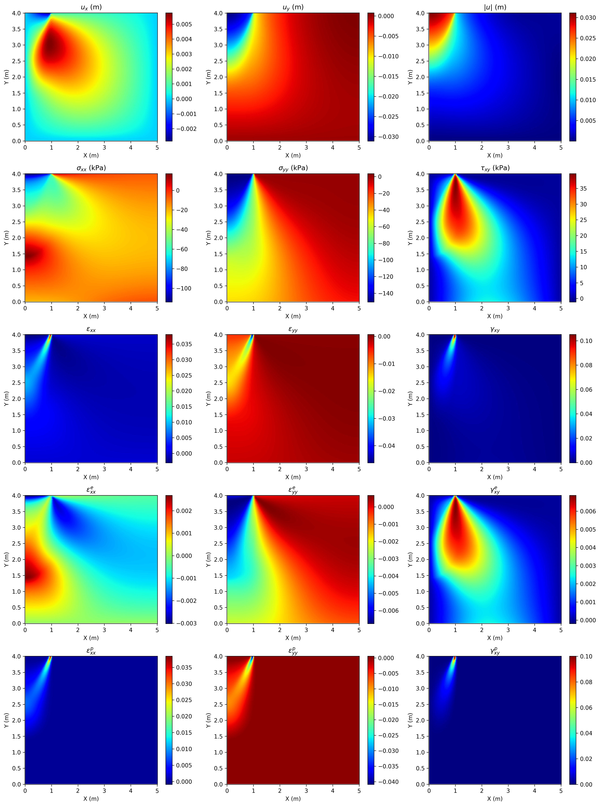
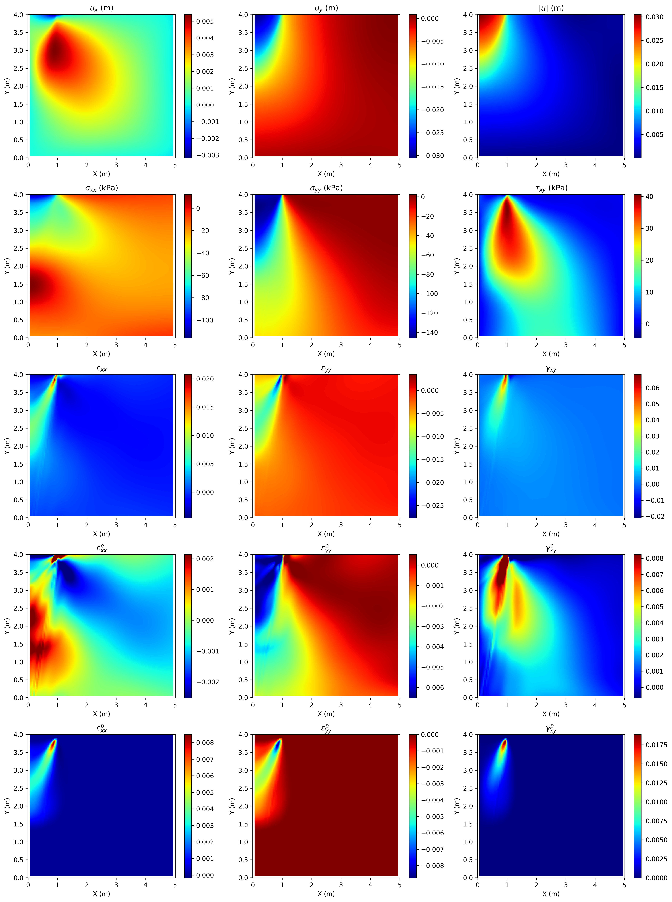
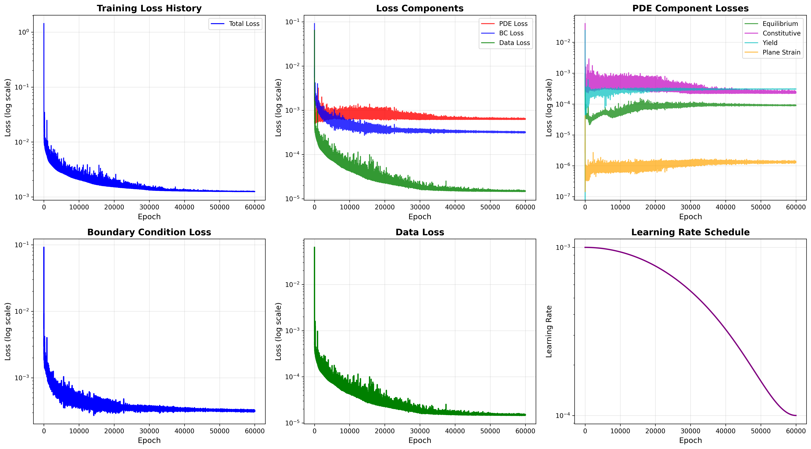
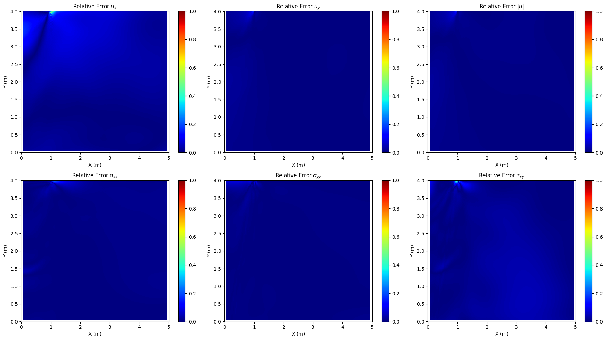
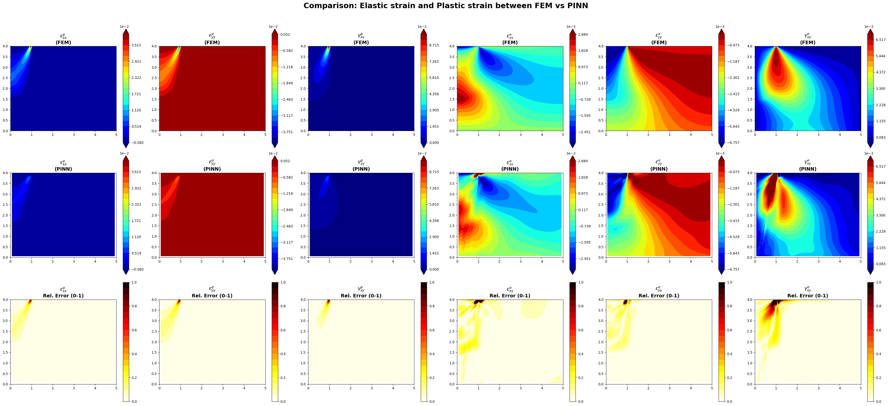
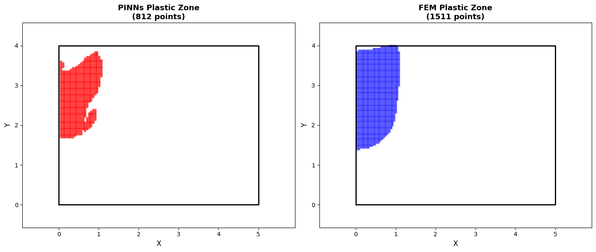
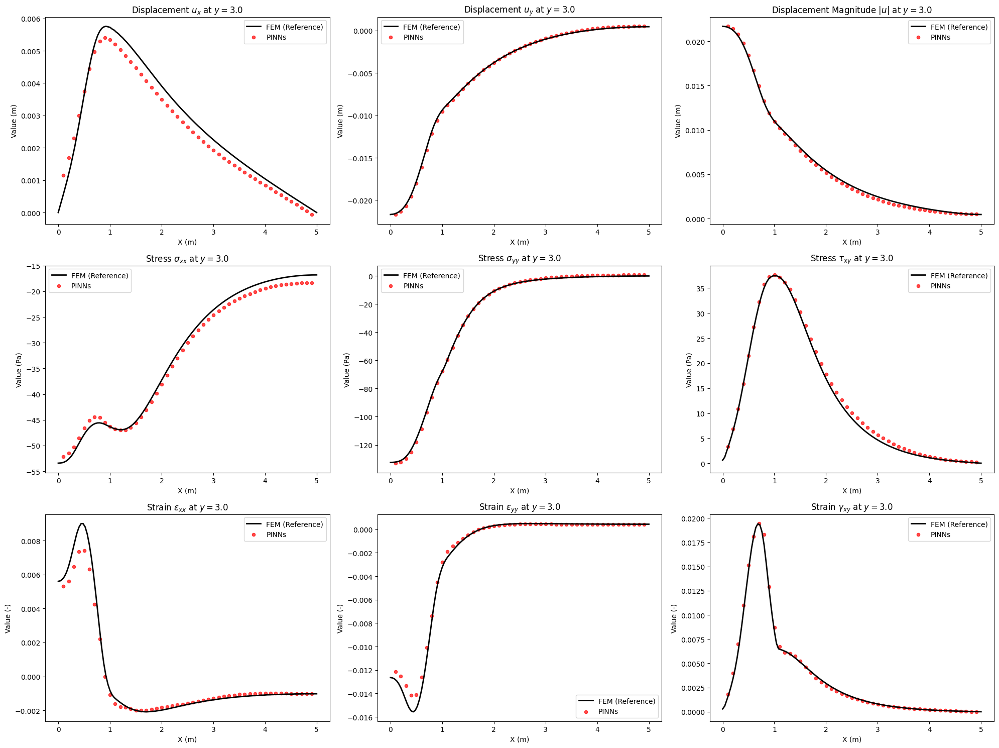
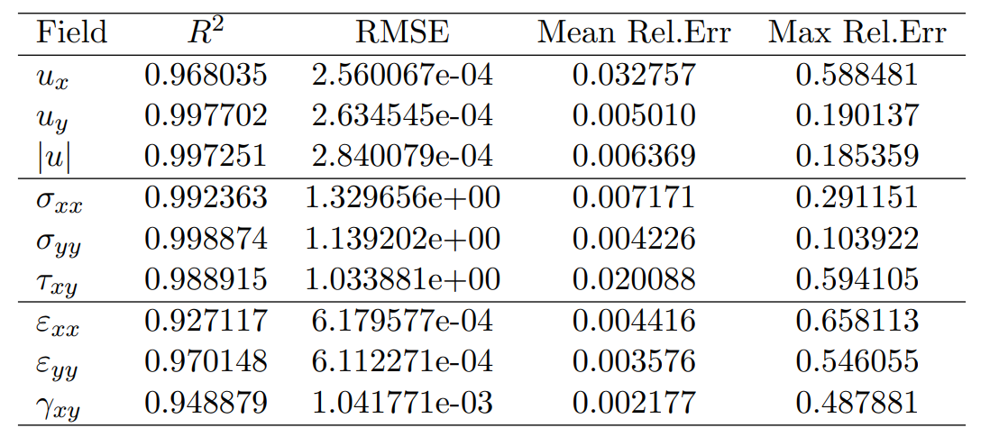

# Physics-Informed Neural Networks (PINNs) for von Mises Material Model

This repository implements a Physics-Informed Neural Network (PINN) framework for modeling materials governed by the von Mises yield criterion. The approach integrates the governing equations of continuum mechanics directly into the neural network training process, enabling data-efficient and physically consistent solutions for elastoplastic problems.

# Overview  
Physics-Informed Neural Networks combine neural networks with physical laws expressed as partial differential equations (PDEs). In this project, PINNs are used to solve boundary value problems involving von Mises elastoplasticity, where the yield condition depends on the second invariant of the deviatoric stress tensor.

# The model enforces:

- Governing Equation (Momentum Balance)

- Constitutive relations (elastic predictor–plastic corrector)

- von Mises yield criterion

- Flow rule and consistency condition (for plastic regime)

- Boundary Condition
  
These constraints are embedded into the loss function and sparse labeled training data.

# Theory of Perfect Plasticity

### 1. Elastic Constitutive Law
$$\huge \displaystyle \boldsymbol{\sigma = \mathbb{C} : \varepsilon^e}$$

### 2. Isotropic Linear Elasticity (Lamé Constants)
$$\huge \displaystyle \boldsymbol{\sigma = 2\mu \varepsilon^e + \lambda \text{tr}(\varepsilon^e)I}$$

### 3. Deviatoric Stress Tensor
$$\huge \displaystyle \boldsymbol{s = \sigma - \frac{1}{3} \text{tr}(\sigma)I}$$

### 4. von Mises Yield Criterion
$$\huge \displaystyle \boldsymbol{f(\sigma) = \sqrt{\frac{3}{2}s : s} - \sigma_{y0} \le 0}$$

### 5. Associative Plastic Flow Rule
$$\huge \displaystyle \boldsymbol{\dot{\varepsilon}^p = \dot{\lambda} \frac{\partial f}{\partial \sigma}}$$

### 6. Plastic Strain Rate Direction
$$\huge \displaystyle \boldsymbol{\dot{\varepsilon}^p = \dot{\lambda} \sqrt{\frac{3}{2}} \frac{s}{\|s\|}}$$

### 7. Karush-Kuhn-Tucker (KKT) Conditions
$$\huge \displaystyle \boldsymbol{\dot{\lambda} \ge 0, \quad f \le 0, \quad \dot{\lambda} f = 0}$$

### 8. Static Equilibrium Equation
$$\huge \displaystyle \boldsymbol{\nabla \cdot \sigma + b = 0}$$

### 9. Additive Decomposition of Strain
$$\huge \displaystyle \boldsymbol{\sigma = \mathbb{C} : (\varepsilon - \varepsilon^p)}$$

# Methodology
- Neural networks approximate field variables such as displacement and stress.
- Automatic differentiation is used to compute strains, and residuals.

# Results
# Stress intensity sampling

# FEM Result

# PINN Result

# Loss vs Epoch

# Comparison FEM VS PINNs 

# Plastic and Elastic strain Comparison between FEM VS PINN

# Comparison AC Yield point

# At y = 3.0 m 

# Evaluation metric

# Features

- PINN formulation for elastoplasticity

- Explicit enforcement of von Mises yield criterion

- Mesh-free solution framework

- Suitable for forward and inverse problems

# Applications

- Solid mechanics and computational plasticity

- Data-driven constitutive modeling

- Parameter identification (e.g., yield stress)

- Benchmarking PINNs against FEM solutions

# Requirements

- Python 3.14

- PyTorch / TensorFlow (depending on implementation)

- NumPy

- Matplotlib

# References
- Raissi, M., Perdikaris, P., & Karniadakis, G. E. (2019). Physics-informed neural networks: A deep learning framework for solving forward and inverse problems involving nonlinear PDEs.
- Chen, X.-X., Zhang, P., & Yin, Z.-Y. (2025). A comprehensive investigation of physics-informed learning in forward and inverse analysis of elastic and elastoplastic footing. Computers and Geotechnics, 181, 107110. https://doi.org/10.1016/j.compgeo.2025.107110
- Haghighat, E., Raissi, M., Moure, A., Gomez, H., & Juanes, R. (2021). A physics-informed deep learning framework for inversion and surrogate modeling in solid mechanics. Computer Methods in Applied Mechanics and Engineering, 379, 113741.

# Author
- Apisit Robjanghvad : M.eng (Geotechnical engineering student), Department of Civil Engineering King Mongkut's University of Technology Thonburi (KMUTT) Email: [apisit65a@gmail.com]
