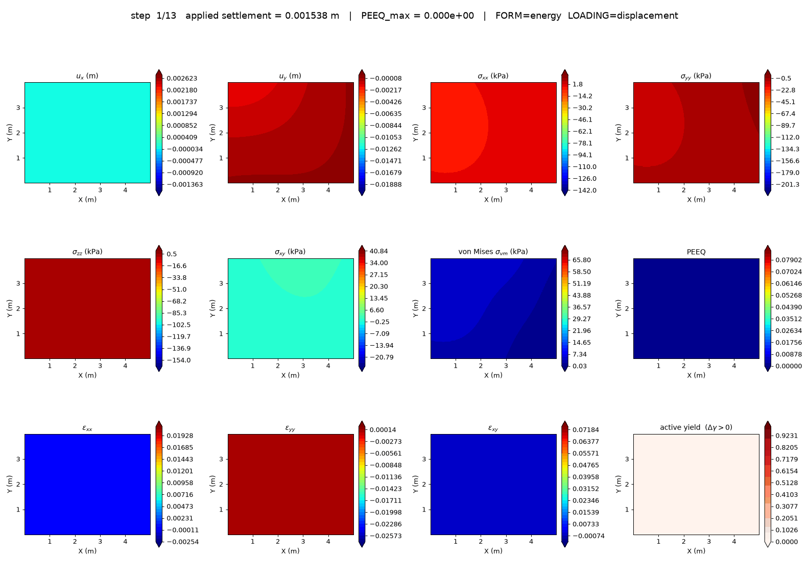
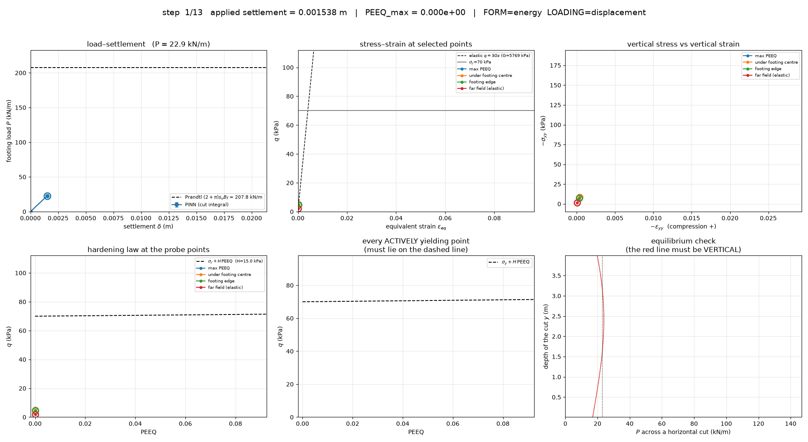
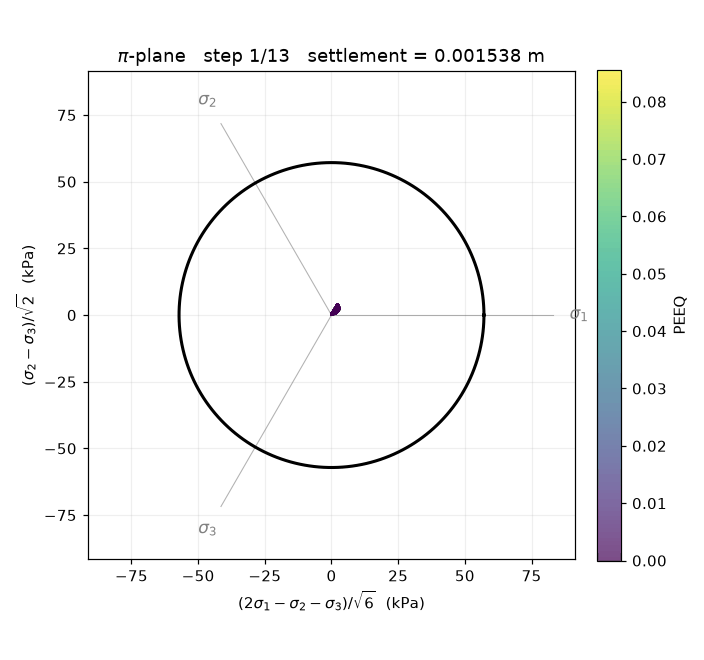

# Data-Free Physics-Informed Neural Network for von Mises Elastoplasticity

A **label-free** Physics-Informed Neural Network (PINN) that solves a 2D plane-strain
von Mises elastoplastic footing problem **without any FEM training data**. The
constitutive law is enforced *exactly* by an **incremental elastic-predictor /
plastic-corrector (radial return)** algorithm, and equilibrium is imposed either in
**strong form** (`div(sigma)=0`) or in **energy form** (a Deep Energy Method based on
an incremental potential). FEM results are used **only for validation**, never for
training.

---

# Overview

Classical PINNs for plasticity let the network output the stresses and then *penalise*
the yield / flow / KKT conditions in the loss (a soft constraint that needs labeled
data to stabilise). **This project does the opposite:**

- The network outputs **only the displacement field** `(u, v)`.
- Strain is obtained from `u` by differentiation.
- **Stress and the plastic state are computed by return mapping**, so the von Mises
  yield criterion, the associative flow rule and the Karush-Kuhn-Tucker (KKT)
  conditions are satisfied **exactly and by construction** — there is nothing to
  penalise and nothing to learn from data.
- The only loss terms are **equilibrium** and **boundary conditions**.

The result is a **mesh-free, data-free forward solver** for history-dependent
elastoplasticity.

### What the loss enforces
- Momentum balance (equilibrium): `div(sigma) + b = 0`
- Boundary conditions (traction and/or displacement)

### What is enforced *exactly* by the return map (NOT in the loss)
- Elastic constitutive law
- von Mises yield criterion (with linear isotropic hardening)
- Associative flow rule and consistency / KKT conditions

---

# Theory (von Mises, linear isotropic hardening)

### 1. Additive strain decomposition
$$\varepsilon = \varepsilon^e + \varepsilon^p$$

### 2. Isotropic linear elasticity (Lamé form)
$$\sigma = \mathbb{C}:\varepsilon^e = 2\mu\,\varepsilon^e + \lambda\,\mathrm{tr}(\varepsilon^e)\,I$$

### 3. Deviatoric stress
$$s = \sigma - \tfrac{1}{3}\,\mathrm{tr}(\sigma)\,I,
\qquad q = \sqrt{\tfrac{3}{2}\,s:s}$$

### 4. von Mises yield criterion with isotropic hardening
$$f(\sigma,\bar\varepsilon^p) = q - \big(\sigma_{y0} + H\,\bar\varepsilon^p\big) \le 0$$

(Set `H_hard = 0` for perfect plasticity; the code uses a small `H` for a unique minimiser.)

### 5. Associative flow rule
$$\dot{\varepsilon}^p = \dot{\lambda}\,\frac{\partial f}{\partial\sigma}
= \dot{\lambda}\,\sqrt{\tfrac{3}{2}}\,\frac{s}{\lVert s\rVert}
= \dot{\lambda}\,n,\qquad n = \tfrac{3}{2}\,\frac{s}{q}$$

### 6. KKT / consistency conditions
$$\dot{\lambda}\ge 0,\qquad f\le 0,\qquad \dot{\lambda}\,f = 0$$

### 7. Equilibrium (no body force)
$$\nabla\cdot\sigma = 0$$

---

# How it works

### A. Network and kinematics
A fully-connected MLP maps coordinates to displacement:
$$(x,y)\;\longrightarrow\;(u,v),\qquad \text{5 hidden layers} \times 128,\ \tanh$$
Inputs are normalised to $[-1,1]$ (this removes `tanh` saturation that otherwise
produces vertical "streak" artefacts in the derived stress field). Strain comes
from the displacement gradients
$$\varepsilon_{xx}=u_{,x},\quad \varepsilon_{yy}=v_{,y},\quad \gamma_{xy}=u_{,y}+v_{,x}$$
(plane strain, $\varepsilon_{zz}=0$), computed by automatic differentiation
(strong form) or by element shape-function gradients (energy form).

### B. Return mapping (the constitutive engine)
Given the total strain and the plastic history `(eps_p, PEEQ)` from the previous step,
the stress is obtained by the standard radial return:

1. **Elastic trial:** `sig_trial = C : (eps_total - eps_p_old)`
2. **Trial yield:** `f_trial = q_trial - (sigma_y + H * PEEQ_old)`
3. **Plastic multiplier** (closed form for linear hardening):
   `dgamma = relu(f_trial) / (3*mu + H)` — the `relu` makes elastic points return `0`.
4. **Radial correction:** scale the deviator back onto the surface,
   `sigma = hydro + (1 - 3*mu*dgamma/q) * s`
5. **Update history:** `eps_p += dgamma * n`, `PEEQ += dgamma`.

Because step 4 projects the trial stress exactly onto the yield surface and step 3
gives `dgamma = 0` in the elastic region, the yield, flow and KKT conditions hold
**identically** — no penalty terms are needed.

### C. Incremental step loading (continuation)
The load is ramped `0 -> load_max` in `n_steps` equal increments. At each step the
plastic history is **frozen**, the network is optimised, and once the step converges
the history `(eps_p, PEEQ)` is **refreshed and carried forward** to the next step.
This reproduces the path-dependence of plasticity and gives a well-conditioned
continuation (each step starts from the previous converged state).

### D. Two interchangeable physics losses
| `FORM` | Minimises | Derivatives | Integration |
|---|---|---|---|
| `'strong'` | `‖div(sigma)‖² + w_bc · BC` | 2nd order | collocation points |
| `'energy'` | `Π (incremental potential) + w_bc · essential BC` | 1st order | 2×2 Gauss |

The strong form enforces equilibrium pointwise (cleaner stresses); the energy form is
cheaper per iteration and enforces tractions weakly. Both share the same network and
the same return map.

### E. Two loading modes
- `LOADING = 'traction'` — prescribe footing **pressure** (`P_MAX`).
- `LOADING = 'displacement'` — prescribe footing **settlement** (`DELTA_MAX`).
  (Recommended for the energy form with low hardening: the potential stays bounded.)

### F. Optimisation
Each load step uses an **Adam warm-up** followed by **L-BFGS** (strong-Wolfe line
search) refinement. Boundary conditions are applied as penalties (soft BC).

---

# Problem setup
- Domain: rectangle `5 m × 4 m`, plane strain.
- Rigid strip footing of width `Bf = 1 m` on the top-left (symmetry) corner.
- Material: `E = 15 MPa`, `nu = 0.3`, `sigma_y = 0.07 MPa` (70 kPa), `H = 0.015 MPa`.
- This is effectively an undrained `phi = 0` bearing-capacity problem, so the
  associative von Mises flow rule is physically appropriate.

---

# Usage
Open `Von-mises.ipynb`, set the two switches at the top of the **Main** cell, and run:
```python
FORM    = 'strong'          # 'strong' or 'energy'
LOADING = 'traction'        # 'traction' or 'displacement'
P_MAX     = 0.150           # footing pressure (MPa)  -> traction
DELTA_MAX = 0.02            # footing settlement (m)  -> displacement
n_steps   = 13              # incremental load steps
```
# Animations (generated by the notebook)
One frame per converged load step, from an `energy` / `displacement` run.

### Field evolution (displacement, stress, strain, von Mises, PEEQ, active yield)


### Engineering curves (load–settlement, stress–strain, q–PEEQ, equilibrium check)


### Stress state in principal space (π-plane / yield-surface view)


---

# Features
- **Data-free / unsupervised** no labeled FEM data used in training.
- Exact enforcement of the von Mises yield criterion via **radial return** (no KKT penalty).
- **Incremental step loading** with carried plastic history (path-dependent).
- Switchable **strong-form** (collocation) and **energy-form** (Deep Energy Method) physics.
- Switchable **traction** / **displacement** control.
- Mesh-free; the background grid / Gauss points are generated from the domain.
- FEM comparison, load-settlement curve, `q`-PEEQ hardening check, π-plane views, and
  per-step animations for diagnostics.

# Applications
- Computational plasticity and solid mechanics
- Physics-based (data-free) constitutive modelling
- Benchmarking PINNs against FEM
- Extensible to pressure-dependent soil models (Drucker-Prager, Mohr-Coulomb) by
  swapping the return map — the equilibrium loss is constitutive-agnostic

---

# Requirements
- Python 3.9+
- PyTorch
- NumPy, Pandas, SciPy
- Matplotlib
- tqdm
- Pillow  (for the GIF animations)

```bash
pip install torch numpy pandas scipy matplotlib tqdm pillow
```

---

# References
- Raissi, M., Perdikaris, P., & Karniadakis, G. E. (2019). *Physics-informed neural
  networks: A deep learning framework for solving forward and inverse problems
  involving nonlinear PDEs.* Journal of Computational Physics, 378, 686-707.
- Chen, X.-X., Zhang, P., & Yin, Z.-Y. (2025). *A comprehensive investigation of
  physics-informed learning in forward and inverse analysis of elastic and
  elastoplastic footing.* Computers and Geotechnics, 181, 107110.
  https://doi.org/10.1016/j.compgeo.2025.107110
- Haghighat, E., Raissi, M., Moure, A., Gomez, H., & Juanes, R. (2021). *A
  physics-informed deep learning framework for inversion and surrogate modeling in
  solid mechanics.* CMAME, 379, 113741.
- Simo, J. C., & Hughes, T. J. R. (1998). *Computational Inelasticity.* Springer.
  (Radial-return / incremental-potential formulation.)

# Author
- **Apisit Robjanghvad** — M.Eng. (Geotechnical Engineering) student, Department of
  Civil Engineering, King Mongkut's University of Technology Thonburi (KMUTT).
  Email: apisit65a@gmail.com
